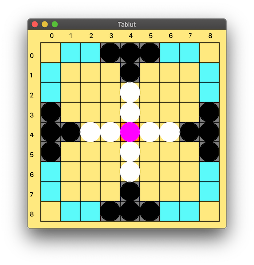

# Tablut player
This Tablut player is a `pip` package and it is written in `Python 3.7.4`.
This has also been tested as working with `Python 3.7.5`. Please, make sure to install one of the specified Python version on your system,
to ensure compatibility.

## Installation

In order to correctly install this Tablut player follow the guidelines specified
in the `Client/` parent directory.\
If everything went fine, now you should be able to execute the player
by running `tablut_player` on your terminal.

## GUI


## Usage
### Arguments
This Tablut player requires only the following positional argument upon execution:
1. `role`: Tablut player role, `White` or `Black`

It is also possible to specify the following optional parameters:
1. `--timeout` or `-t`: Integer value, which is the given time to compute each move, in seconds (defaults to `60`)
2. `--server-ip` or `-s`: String representing the IP address where the server is running (defaults to `localhost`)
3. `--autoplay` or `-a`: Flag that specifies to avoid connecting to the server. With this flag enabled a GUI will be opened (defaults to `False`)
4. `--players` or `-p`: List of 1 or 2 player types strings (not case sensitive), to be specified along with the `-a` flag (defaults to `minimax`)
5. `--genetic` or `-g`: Specifies to launch the training algorithm, with the given number of generations and players, in order
6. `--debug` or `-d`: Run the command in verbose mode (defaults to `False`)

If you need further help, you can type `tablut_player -h` or `tablut_player --help` in a command line.

### Use cases examples

**W/ server**\
The following snippet will launch a white random player, connect to the
server in localhost and give to the random player 60 seconds to compute each move:
```bash
tablut_player White -t 60 -s 127.0.0.1 -p random
```

The same thing could be done exploiting default values:
```bash
tablut_player White -p random
```

Or even more, this will do the same as specified above, with the usage of a minimax player:
```bash
tablut_player White
```

**W/o server**\
The following snippet will launch a black minimax player vs a white monte carlo player, with my player being the black one:
```bash
tablut_player Black -ap minimax montecarlo
```

The following snippet will launch a black monte carlo player vs a white minimax player, with my player being the black one:
```bash
tablut_player Black -ap montecarlo minimax
```

The following snippet will launch a white minimax player vs a black monte carlo player, with my player being the white one:
```bash
tablut_player White -ap minimax montecarlo
```

The following snippet will launch both white and black negamax players, with my player being the white one:
```bash
tablut_player White -ap negamax
```

**Training**\
The following snippet will launch the genetic algorithm with 10 generations and 20 player for each generation. In this case the mandatory parameter is ignored. It is also possible to specify the player type, but we recommend using `minimax`:
```bash
tablut_player White -g 10 20 -p minimax
```
